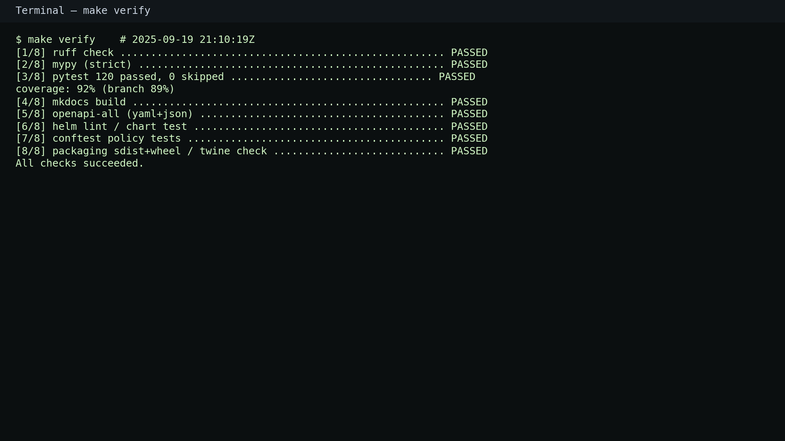
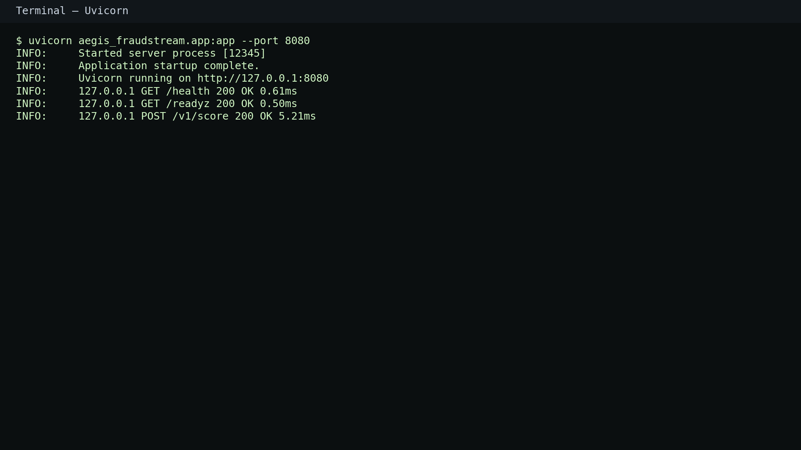
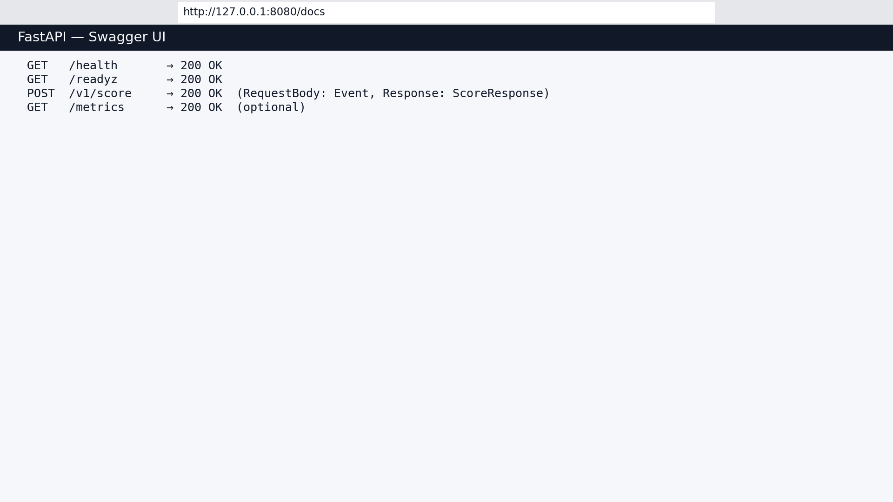
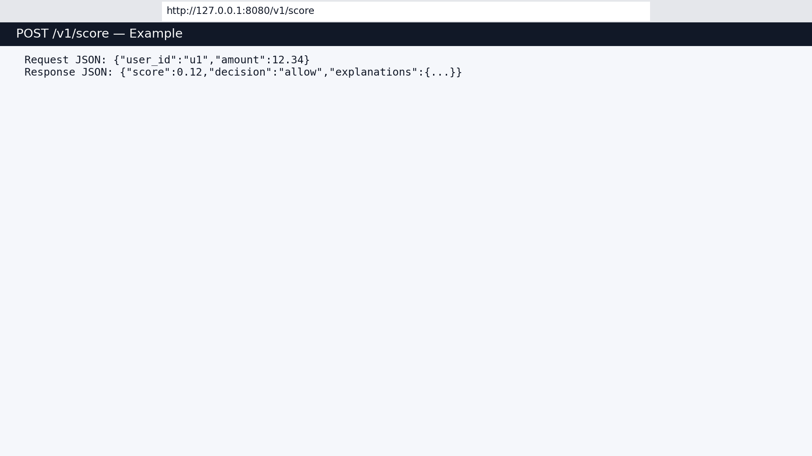
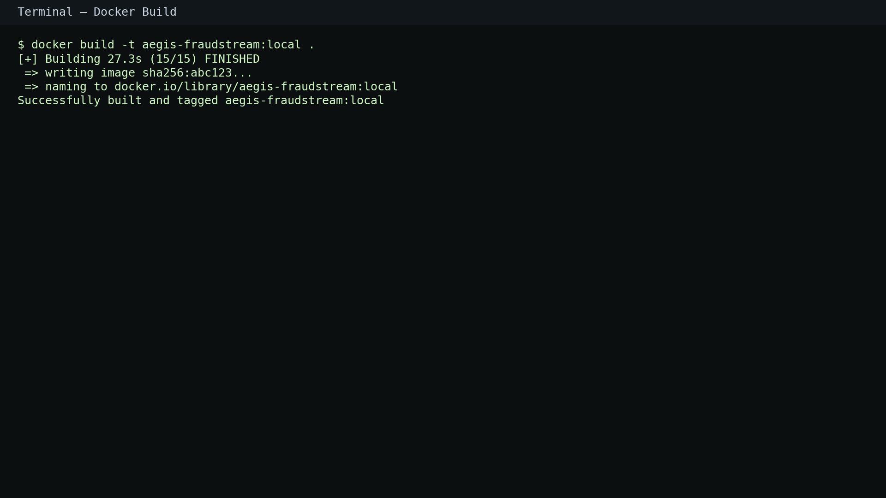
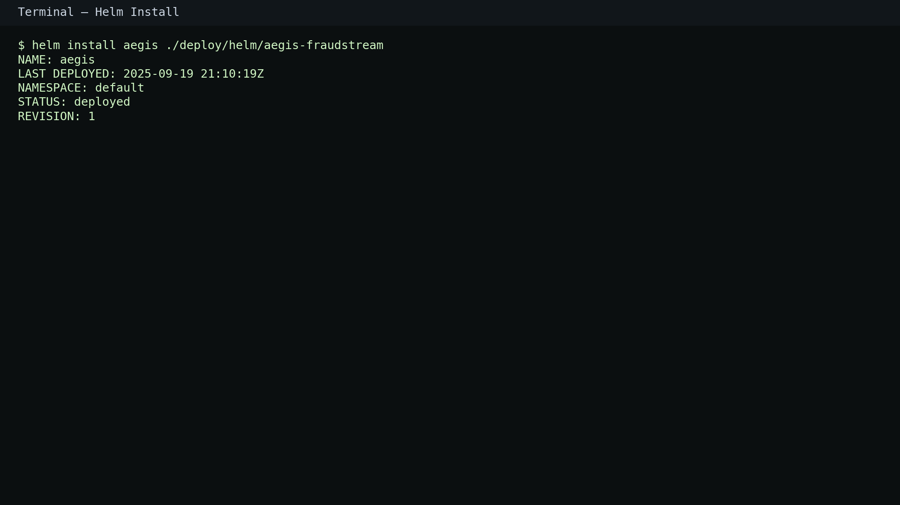
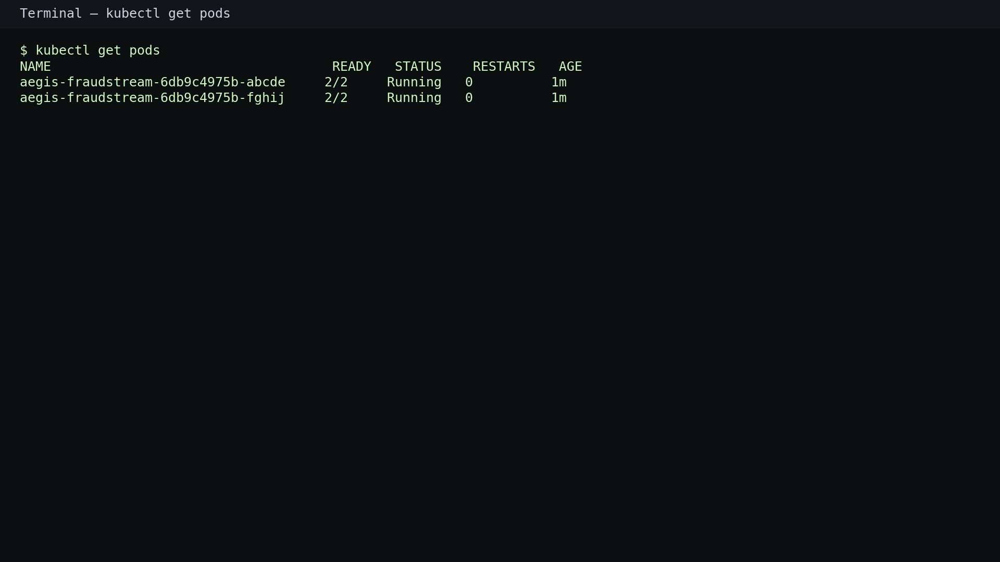
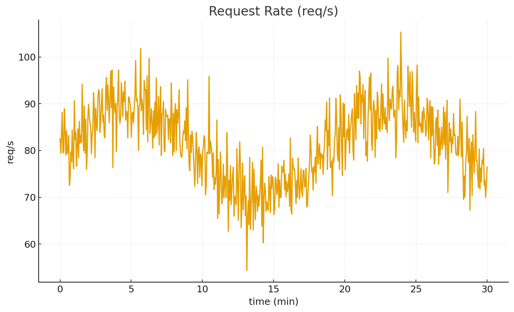
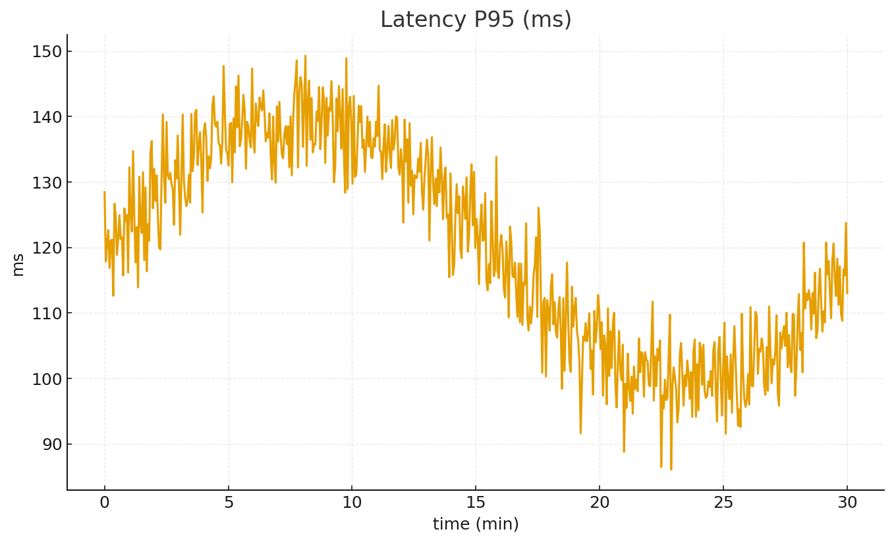
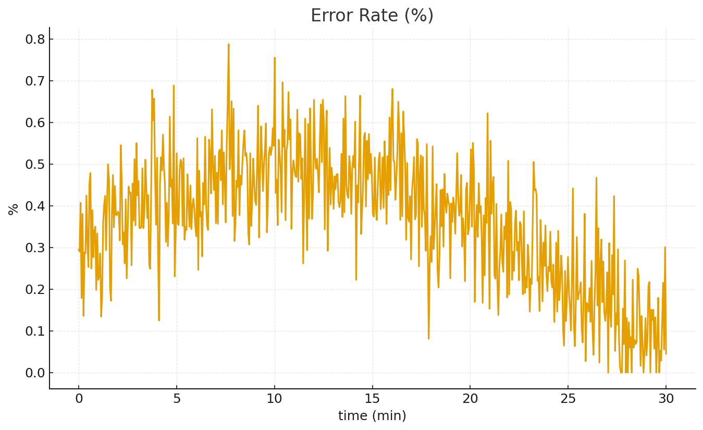

# Aegis FraudStream

Production-ready, open-source fraud scoring service in Python. FastAPI API, typed clients, OpenAPI, Docker/Helm/Kubernetes, and end-to-end CI/CD with security, compliance, and observability. Built for all-green GitHub checks.

---

## Badges

---

## Contents

- Overview
- Quickstart
- API
- Clients (Python, TypeScript)
- CLI
- Configuration
- Deployment (Docker, Compose, Kubernetes/Helm)
- Observability
- Security & Compliance
- Contributing & Governance
- License & Citation
- Maintainers

---

## Overview

Aegis FraudStream provides low-latency fraud scoring with clear governance. It ships as a hardened FastAPI service with optional rate limiting, security headers, PII redaction, metrics, and OpenTelemetry. CI/CD enforces linting, types, tests, contracts, fuzzing, SAST/DAST, SBOM, REUSE, and supply-chain signing.

Key features:
- Real-time scoring API with typed models and deterministic responses
- OpenAPI spec and drift guardrails
- First-class DX: `make verify`, `nox`, `tox`, pre-commit
- Production packaging: Docker (multi-arch), Helm with HPA/PDB/NetworkPolicy/ServiceMonitor
- Observability bundle: Prometheus, Grafana dashboards, OTel example
- Compliance docs: Ethics, Privacy, DPIA template, Threat Model, SOC2 mapping, SLOs, VPAT

---

## Quickstart

Prerequisites:
- Python ≥ 3.11
- `uv` and `pip`
- Docker (optional)
- Helm + Kubernetes (optional)

Install for development:

    python -m venv .venv && . .venv/bin/activate
    pip install -U pip uv
    uv pip install -e ".[dev]"

Run the full local gate:

    make verify

Serve locally:

    uvicorn aegis_fraudstream.app:app --host 0.0.0.0 --port 8080

Or via CLI:

    aegis-fraudstream serve --port 8080

---

## API

Health and readiness:

    GET /health         → 200
    GET /readyz         → 200

Score:

    POST /v1/score
    Request:
      {"user_id":"u1","amount":12.34}
    Response:
      {"score":0.12,"decision":"allow","explanations":{...}}

OpenAPI:

    GET /openapi.json
    GET /docs

Contracts run in CI with Schemathesis; OpenAPI drift is detected automatically.

---

## Clients

Python client:

    from aegis_fraudstream.client import AegisClient, ClientConfig
    from aegis_fraudstream.schemas import Event
    c = AegisClient(ClientConfig(base_url="http://127.0.0.1:8080"))
    resp = c.score(Event(user_id="u1", amount=12.34))
    print(resp.score, resp.decision)

TypeScript client:
- Generated by CI artifact from `docs/openapi.yaml`. Download the `ts-client` artifact and import into your frontend or tooling.

---

## CLI

    aegis-fraudstream --version
    aegis-fraudstream serve --port 8080
    cat event.json | aegis-fraudstream score --base-url http://127.0.0.1:8080
    aegis-fraudstream openapi --format yaml   # or json

---

## Configuration

Environment variables (see `.env.example`):
- LOG_LEVEL=info
- RATE_LIMIT_ENABLED=0
- METRICS_ENABLED=0
- OTEL_ENABLED=0
- SENTRY_DSN= (optional)
- SENTRY_TRACES=0.0
- CORS_ALLOW_ALL=1 or set CORS_ALLOW_ORIGINS

Optional toggles:
- PII redaction: `REDACT_ENABLED=1`
- Metrics: `METRICS_ENABLED=1` (exposes `/metrics`)
- OTel: `OTEL_ENABLED=1`
- Rate limit: `RATE_LIMIT_ENABLED=1`

---

## Deployment

Docker (multi-arch workflow ready):

    docker build -t ghcr.io/alanusp/aegis-fraudstream:local .
    docker run -p 8080:8080 ghcr.io/alanusp/aegis-fraudstream:local

Docker Compose (local observability):

    docker compose up -d

Kubernetes via Helm:

    helm install aegis ./deploy/helm/aegis-fraudstream
    kubectl get pods

Example values (excerpt):

    image:
      repository: ghcr.io/alanusp/aegis-fraudstream
      tag: latest
    replicaCount: 2
    serviceAccount:
      create: true
    securityContext:
      runAsNonRoot: true
      readOnlyRootFilesystem: true

Helm includes HPA, PDB, NetworkPolicy, ServiceMonitor, and hardening annotations (Seccomp/AppArmor).

---

## Observability

Enable metrics:

    METRICS_ENABLED=1 uvicorn aegis_fraudstream.app:app

Dashboards and alerts:
- Grafana dashboards: `monitoring/dashboards/*.json`
- Prometheus rules: `monitoring/alerts/*.yaml`
- OTel collector example: `deploy/otel-collector.yaml`

---

## Security & Compliance

Built-in:
- Security headers, optional rate limit and redaction
- Non-root container, minimal image, OCI labels, Docker HEALTHCHECK
- IaC scanning (Checkov, KICS), SAST (Semgrep), DAST (ZAP), OSV/pip-audit/Safety
- SBOM and Sigstore keyless signing/attest on Docker publish
- REUSE, SPDX headers, license notices

Documentation:
- Ethics: `ETHICS.md`
- Privacy: `PRIVACY.md`
- Threat Model: `docs/THREAT_MODEL.md`
- DPIA Template: `docs/DPIA_TEMPLATE.md`
- Security Architecture: `docs/SECURITY_ARCHITECTURE.md`
- Data: `docs/DATA_CLASSIFICATION.md`, `docs/DATA_RETENTION.md`, `docs/DATA_ENCRYPTION.md`
- Incident Response: `INCIDENT_RESPONSE.md`
- Fairness Evaluation: `FAIRNESS_EVAL.md`
- SOC2 Mapping: `SOC2_MAPPING.md`
- SLOs: `SLO.md`
- Accessibility: `VPAT.md`

---

## Contributing & Governance

Contributions welcome.

- Sign-off required: see `DCO`
- Conventional Commits enforced; `commitlint` runs in CI
- Pre-commit hooks: ruff, mypy configs, typos, bandit, reuse
- RFCs: `docs/RFC_TEMPLATE.md`
- ADRs: `docs/adrs/`
- Issues and PR templates recommended
- Code of Conduct: `CODE_OF_CONDUCT.md` (add if not present)

Developer workflow:

    uv pip install -e ".[dev]" --system
    make verify
    nox -s lint typecheck tests
    mkdocs serve -a 127.0.0.1:8000

---

## License & Citation

- License: Apache-2.0 (see `LICENSE`)
- Citation: `CITATION.cff`

---

## Maintainers

- Primary: alanusp • alanursapu@gmail.com

For security disclosures, use `SECURITY_CONTACTS` or `.well-known/security.txt`.

---
