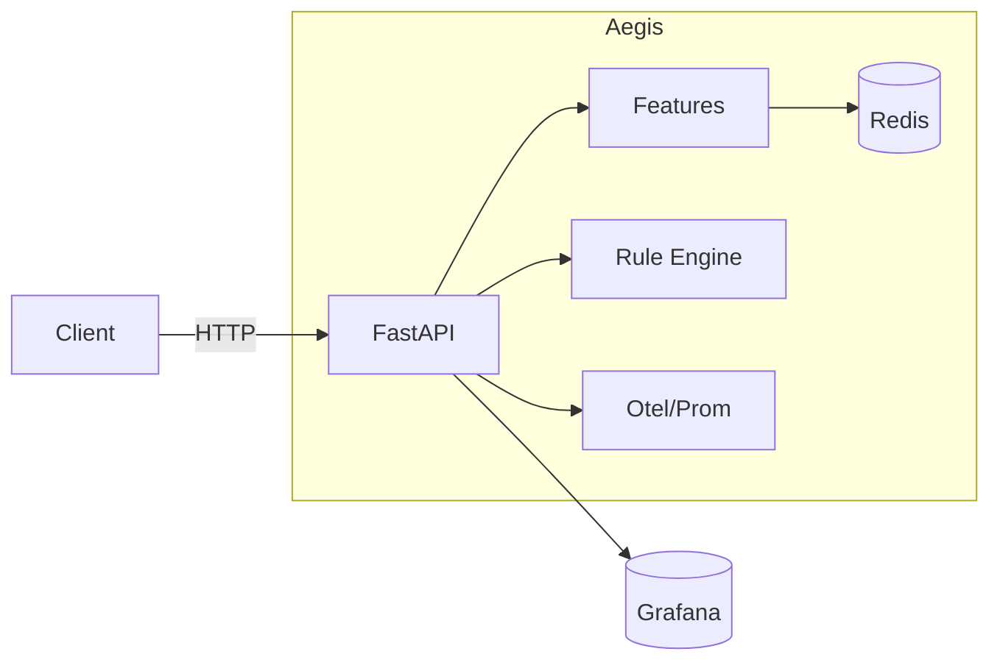

# Architecture

```mermaid
flowchart LR
  C[Client] -->|HTTP| API
  subgraph Aegis
    API[FastAPI] --> Features
    Features --> Redis[(Redis)]
    API --> Model[Rule Engine]
    API --> Telemetry[Otel/Prom]
  end
  API --> Grafana[(Grafana)]
```
